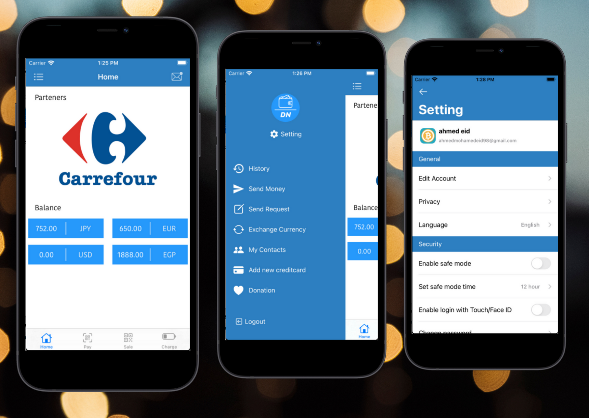
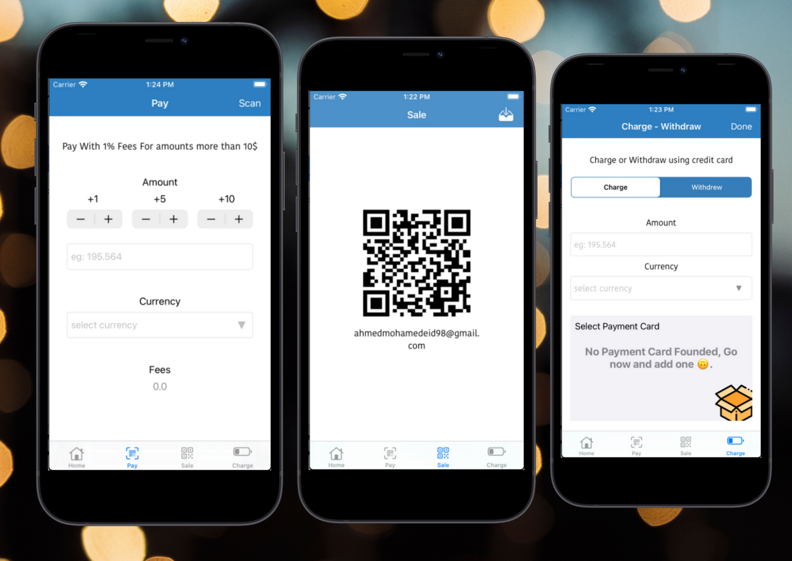
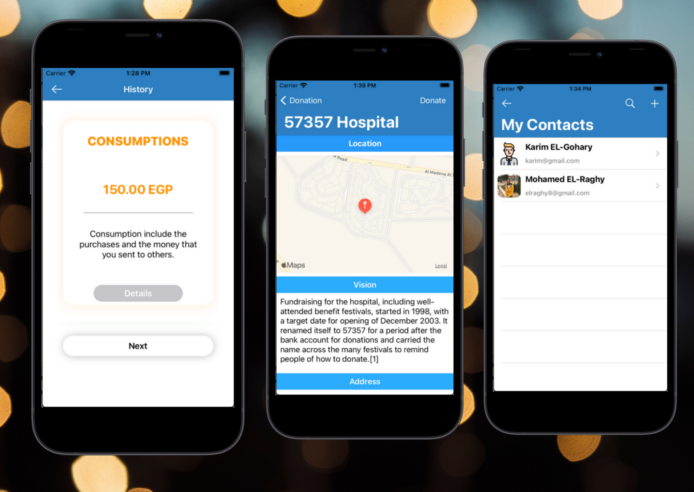

# DN-Wallet
Graduation Project

## Motivation

Money is the main thing that all humanity shares and interested in, so we want to make it easy to be controlled, more secure, and fast for any person and protect its privacy. All that just in one click. Most people who use cash could put them in danger of mugging. They are also afraid of using finance technology because it's difficult to use and it could have several problems and insecurity that lead to fraud.

 

## Idea

DN-Wallet is a movement from traditional payment methods to digitalization for faster transactions. It’s based on Blockchain technology to ensure security and privacy, all that we provide with ease of use. 

 

## Goals
 

Our application provides transaction money or purchasing stuff with emails or scan, exchange currency, safe mode is a capability that makes the transaction enabled for a period of time, history to tracking your payment, heir for the owner and for the security part the transaction saved in blockchain, you can access the application with different ways face-id, finger-print, password and we provide chatbot to help the user. all that capabilities we provide with good user interface and easiness of usage.  

## Achievements (60%)

  <ol>
    <li>User Can Create account and login with email, TouchID, and FaceID</li>
    <li>Reset Password</li>
    <li>Add phone number and recieve confirmation code</li>
    <li>Add Credit Card [Simulation]</li>
    <li>Add new Contact, or remove existing contact</li>
    <li>Charge Wallet - Move Money From Credit to Our Bank(Simulation) and Record Transaction in Blockchain.</li>
    <li>Withdraw Money - Move Money From Our Bank to User Credit and Record Transaction in Blockchain.</li>
    <li>Transfer Money - Record Transaction in Blockchain.</li>
    <li>Donation - Transfer Money To a charity.</li>
    <li>Active Safe Mode - deactivate some service for a time period.</li>
    </ol>

 

## ScreanShots

  

 

  

 

  
 

  

  
 

